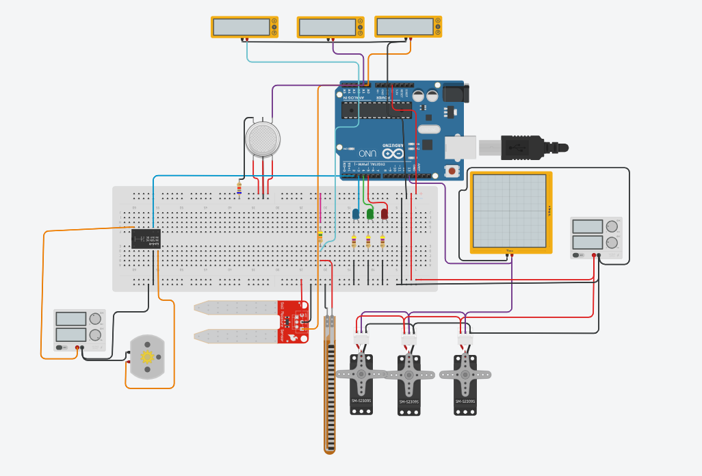

[back](./)

## Manufacturing
### 2025
- Wrote short review article on additive manufacturing in titanium-alloy hip implants (Manuf. & Production Tech).

### 2023
- Determined the effect of PLA plastic specimens 3D printed in 3 different orientations (horizontal, vertical, tilted at 45° angle) on shear strength.

## Mechatronics
### 2025
- Researched and applied reinforcement learning to an EEG-controlled robotic hand with 3 others. Was able to obtain an 88% success rate in controlling hand by tensing and relaxing (ME Design I & II).

### 2024
- Designed SOLIDWORKS assembly and simulated circuit for automatic Febreze sprayer (Mechatronics).
- Designed automated desk debris sweeper; mechanism converts linear motion to be orthogonal to its original direction. Mechanism controlled by stepper motors to control motor direction and PWM controls to control distance traveled (Mechatronics).
- Utilized Propeller 2 chip and voltage divider circuits to create a physically interactive video game, learning embedded microcontroller programming (Mechatronics).
- Designed and simulated automated greenhouse responsible for providing water and oxygen to plants and alerting farmers when to harvest. Created throughTinkerCAD (Mechatronics).

- Developed circuits to create electro-mechanical systems such as a simulated Geneva drive mechanism system (Mechatronics).
- Designed and proposed brain-computer interface EEG with filtering to ease movement post-stroke (Physiology II).

## CAD + Drawings
### 2024
Designed and CAD-ed hair claw that opens with 2 lbs on it and lasts for 5,000+ cycles. Created drawing for assembly (Machine Elements).

### 2023
Sketched and produced four-part Autodesk Inventor assembly and drawing of pencil sharpener (Intro CAD).
CAD-ed using Autodesk Inventor dollhouse with furniture. Created drawing and assignment for part (Intro CAD).

## Heat/Thermodynamics
### 2024
- Created Python program simulating thermal response of iron after laser removal (Heat & Mass Transfer).

### 2023
- Used Python to study simple Rankine cycle and Rankine cycle with reheat and regeneration (Thermodynamics).

## Systems Engineering
### 2022
- With 3 students, created a project management plan to develop sports mobile app with objectives tree, indices of performance, technical dependencies & design requirements, and project roadmap (Intro to Sys. Eng.).
- Worked with 3 students to recommend the Virginia Department of Transportation (VDOT) solutions that address connected vehicle applications and that improve safety and efficiency of Virginia’s work zones (Intro to Sys. Eng.).
