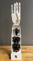

## Senior Capstone Project
<html>
  <head>
  
  </head>
  

    
  

</html>

<!---<html>
  
</html>-->

<!----->

### EEG-Controlled Robotic Arm
_A robotic arm designed to clench and unclench based on tensing and relaxing._

## Mechatronics and Robotics Society (MARS) – UVA NASA Lunabotics Team

### Artie
_After major effort was put into the team's project management, systems engineering, and mechanical engineering design, Artie became the first MARS rover to place in the top ten, earning fifth place in the arena and the Innovation Award._

### Simulated Lunar Surface Arena
_MARS' independent research project to bring about a simulated lunar surface arena by Fall 2025!_

### Bermie
_As MARS' 2024 lunar rover, Bermie became the first in the team's history to score points in the NASA Lunabotics Challenge!_

### Rocks-Anne
_The last lunar rover built by MARS to mine rocks in a simulated lunar surface._ 
