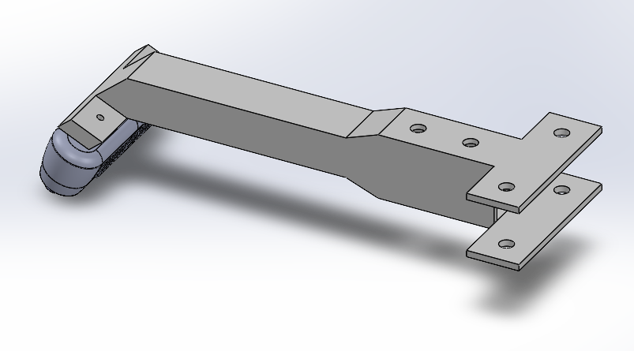
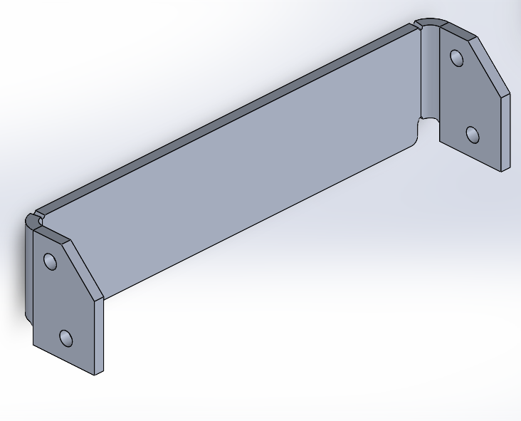
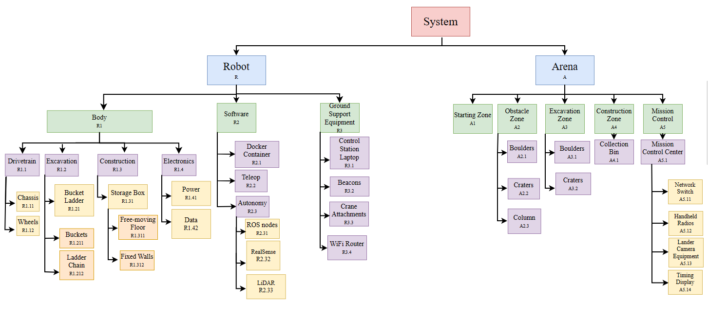
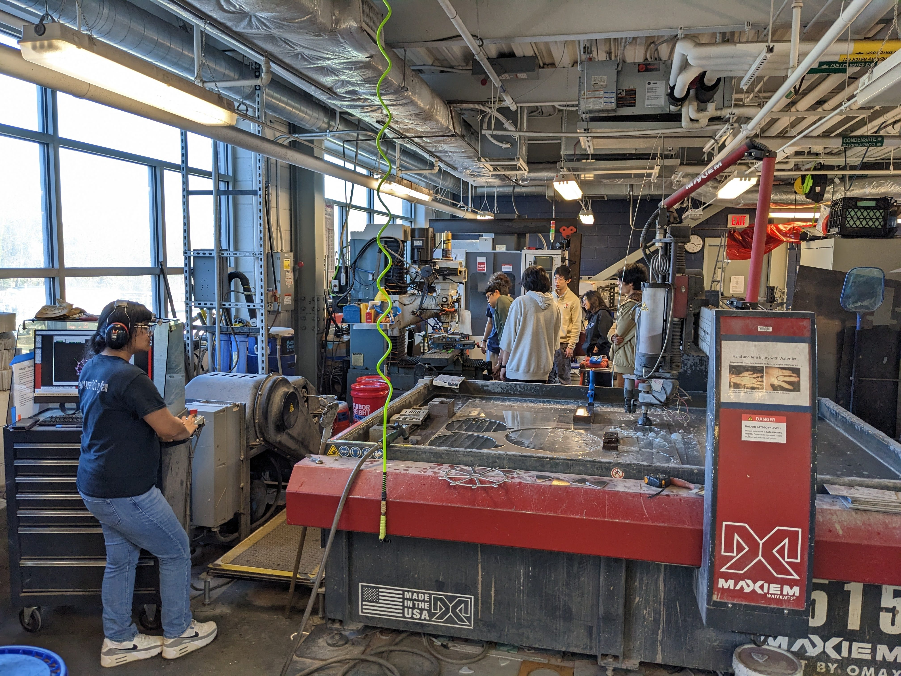
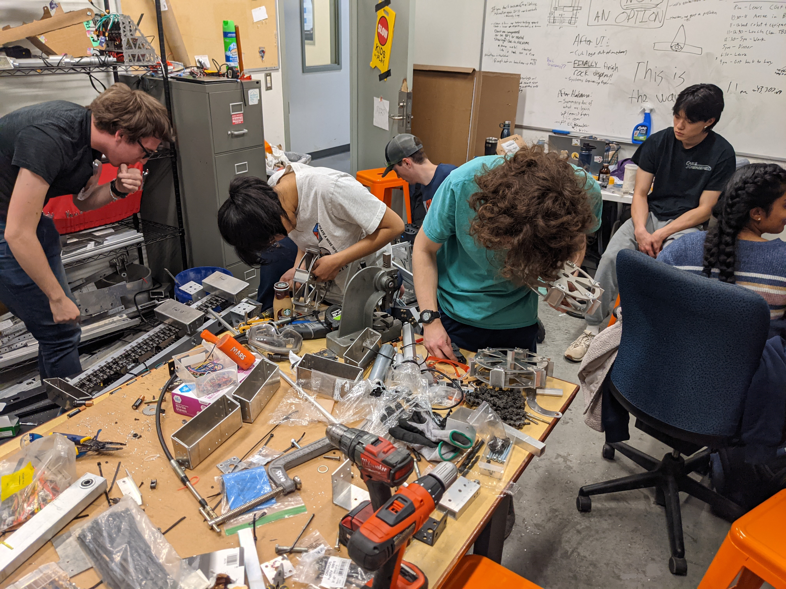

# Mechatronics and Robotics Society (MARS) – UVA NASA Lunabotics Team	University of Virginia
## CAD Highlights
### 2025

<html>
<head>

</head>
<body>

 3D-printed camera mount 

</body>
</html>

### 2024

<html>
<head>

</head>
<body>

The above picture displays the wheel grousers I CAD-ed for our skid-steer drivetrain. My final CAD, made with SOLIDWORKS' Sheet Metal functionality, took account of the various machining practices needed to create them such as waterjetting and metal bending. As MARS typically makes modular designs, the grousers are attached to each wheel shell via small steel dowels and rivets. 

</body>
</html>

## Systems Engineering Highlights
### 2025

<html>
<head>

</head>
<body>

 2025 Final Systems Hierarchy 

</body>
</html>
  
### 2024

<html>
<head>

</head>
<body>

2024 CDR Hierarchy. 

</body>
</html>

## Manufacturing Highlights

<html>
<head>

</head>
<body>

Waterjetting wheels for 2025 rover, Artie. 

</body>
</html>

<html>
<head>

</head>
<body>

Assembling wheel for 2023 rover, Rocks-anne. 

</body>
</html>
